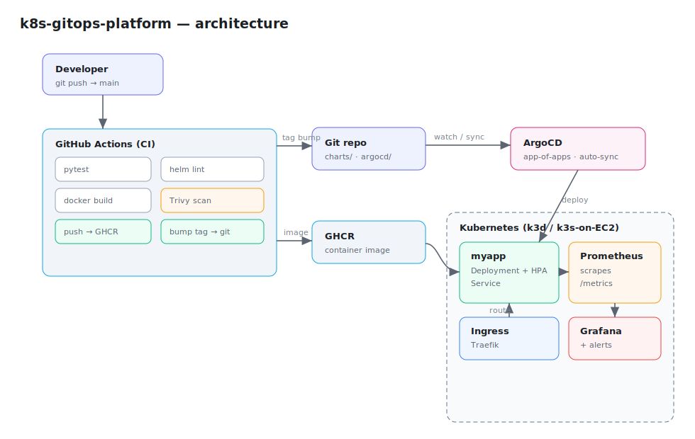
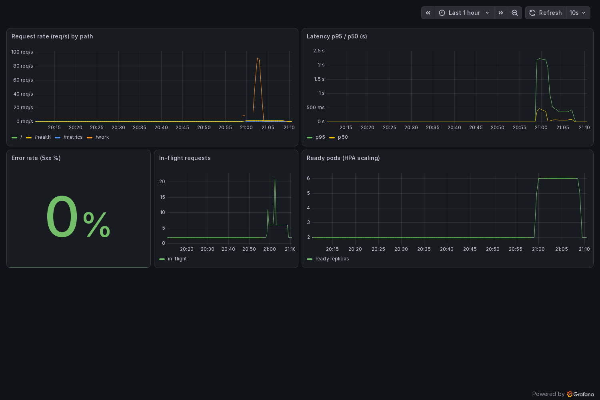

# k8s-gitops-platform

A small but **production-shaped** platform that deploys a containerized service to
Kubernetes the GitOps way, with full observability and a security-gated CI pipeline.

Push to `main` → CI builds, scans and publishes the image, then bumps the image
tag in git → **ArgoCD** notices the change and syncs the cluster. No `kubectl apply`
from the pipeline; git is the single source of truth.



## What it demonstrates

| Area              | Tech                                                                 |
| ----------------- | ------------------------------------------------------------------- |
| Containerization  | Multi-stage **Dockerfile**, non-root, read-only rootfs, healthcheck |
| Packaging         | **Helm** chart (Deployment, Service, Ingress, HPA, ConfigMap, Secret, ServiceMonitor, PrometheusRule) |
| GitOps            | **ArgoCD** app-of-apps, automated sync + self-heal, Helm multi-source |
| Observability     | **Prometheus** scrape via ServiceMonitor, **Grafana** dashboard, **Alertmanager → Telegram** |
| Autoscaling       | **HPA** v2 on CPU, driven by metrics-server; **k6** ramping load test |
| CI/CD             | **GitHub Actions**: tests, helm lint, build, **Trivy** CVE scan, GHCR push, GitOps tag bump |
| DevSecOps         | Trivy image scan (fail on CRITICAL/HIGH) + Trivy IaC misconfig scan → SARIF in Security tab |
| IaC (cloud)       | **Terraform** module: k3s on EC2 (Spot) for the cloud version       |

## Repository layout

```
app/                 FastAPI service exposing /metrics, /health, /work  + Dockerfile + tests
charts/myapp/        Helm chart for the app (+ bundled Grafana dashboard + PrometheusRule)
monitoring/          kube-prometheus-stack values + Alertmanager→Telegram overlay
loadtest/            k6 ramping load test that drives the HPA
argocd/              AppProject + app-of-apps root + Applications (myapp, monitoring)
terraform/           k3s-on-EC2 module (Spot) for a cloud deployment
.github/workflows/   ci.yaml (build/scan/push/bump) + iac-scan.yaml (Trivy config)
Makefile             one-command local stack
```

## Quickstart — local (k3d)

Requires Docker, `kubectl`, `helm`, `k3d`.

```bash
make bootstrap        # create k3d cluster + install monitoring + deploy the app via Helm
make urls             # print Grafana / Prometheus / app endpoints
echo "127.0.0.1 myapp.localhost" | sudo tee -a /etc/hosts
curl http://myapp.localhost:8080/         # hit the app through the Traefik ingress
```

Show the autoscaler reacting to load:

```bash
make k6               # ramping k6 load test against /work
watch kubectl -n myapp get hpa,pods   # replicas climb 2 → 6
```

`make load` is a simpler curl-loop alternative. Under the k6 ramp the HPA was
observed at `cpu: 170%/60%` holding **6/6** replicas, then scaling back down on
cool-down.

### Verified working

Everything below was exercised end-to-end on a local k3d cluster:

- both app pods scraped by Prometheus (`http://…:8000/metrics`, target **health=up**)
- `http_requests_total` / latency histograms queryable in Prometheus
- Grafana auto-loads the **myapp / FastAPI service** dashboard via the sidecar
- HPA reads CPU from metrics-server and scales 2 → 6 → 2 around the k6 load (below)

The bundled Grafana dashboard during a `make k6` run — request rate, p95/p50
latency, 0% error rate, in-flight requests, and the HPA scaling 2 → 6 → 2:



## Alerting (Telegram)

`charts/myapp` ships a **PrometheusRule** (`MyappTargetDown`, `MyappHighErrorRate`,
`MyappHighLatencyP95`) — verified loaded into Prometheus and evaluating. To route
firing alerts to Telegram, install the monitoring stack with the overlay:

```bash
# put your @BotFather token + chat id in monitoring/alertmanager-telegram.yaml
make monitoring-telegram
```

The overlay adds a Telegram receiver to Alertmanager and routes everything from
the `myapp` namespace plus any `severity: critical` alert to your chat.

## The GitOps loop (real cluster)

The Helm quickstart above is the fast path. To run the **actual GitOps flow**:

```bash
make argocd           # install ArgoCD + apply the app-of-apps root
```

ArgoCD then reconciles everything under `argocd/apps/` from this git repo:
`myapp` (the Helm chart) and `monitoring` (kube-prometheus-stack pulled from the
upstream Helm repo, with values sourced from this repo via a `$values` reference).

> Point `repoURL` in `argocd/` and the image `repository` in `charts/myapp/values.yaml`
> at your own GitHub/GHCR before syncing.

## CI/CD

`.github/workflows/ci.yaml` on push to `main`:

1. **test** — pytest against the app
2. **helm-lint** — `helm lint` + render sanity check
3. **build-scan-push** — build image, **Trivy** scan (fails on fixable CRITICAL/HIGH), push to GHCR, upload SARIF
4. **bump-manifest** — write the new image tag into `charts/myapp/values.yaml` and commit (`[skip ci]`) → ArgoCD deploys it

`.github/workflows/iac-scan.yaml` runs `trivy config` over Helm/manifests/Terraform.

## Cloud deployment (Terraform)

```bash
cd terraform
cp example.tfvars terraform.tfvars   # set ssh_public_key, lock allowed_cidr to your IP
terraform init && terraform apply
terraform output fetch_kubeconfig    # copies the kubeconfig to your machine
```

Provisions a Spot EC2 node, installs k3s via cloud-init, and exposes the API +
Traefik ingress. From there the GitOps loop is identical to local.

## Cleanup

```bash
make clean            # delete the k3d cluster
cd terraform && terraform destroy
```
